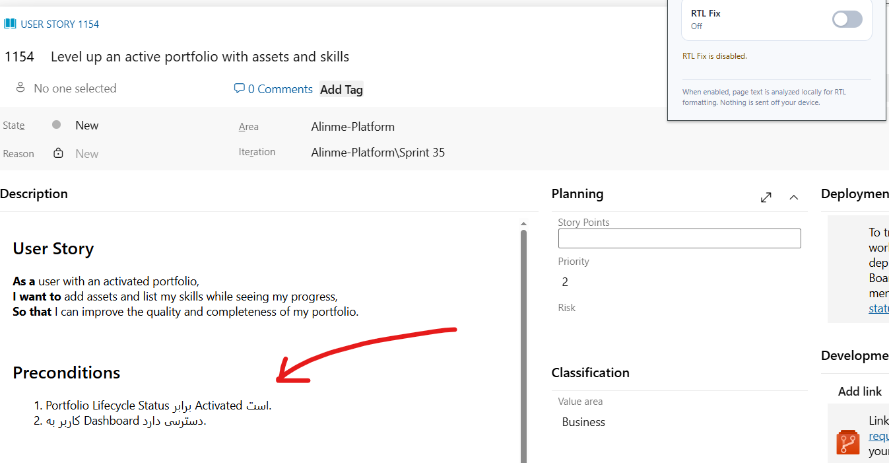
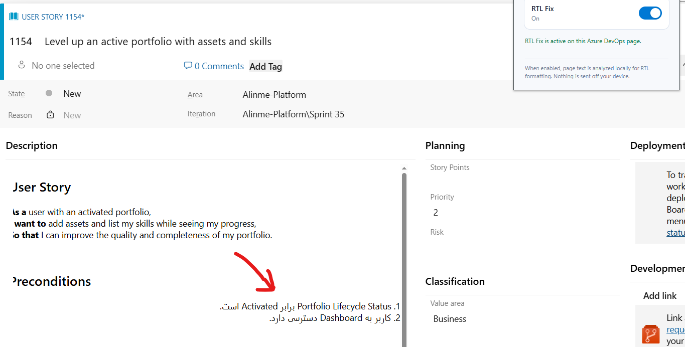

<p align="center">
  
</p>

<h1 align="center">Azure DevOps RTL Chrome Extension</h1>

<p align="center">
  <strong>Readable Persian and Arabic content inside Azure DevOps.</strong>
</p>

<p align="center">
  A lightweight Chrome extension that applies accurate RTL direction and right alignment<br>
  while keeping embedded English technical terms readable.
</p>

<p align="center">
  
  
  
</p>

---

Azure DevOps uses a left-to-right interface, which can make Persian and Arabic work-item content difficult to read—especially when a sentence contains English terms such as `REST API`, `Dashboard`, or `Activation`. Azure DevOps RTL Fixer detects meaningful RTL content and corrects its presentation without modifying the stored work-item text.

> Azure DevOps RTL Fixer is an independent project and is not affiliated with or endorsed by Microsoft.

## ✨ Features

- 🔤 Detects Persian and Arabic-script text in Azure DevOps content.
- ↔️ Applies RTL direction and right alignment to the relevant logical text block.
- 🧠 Handles mixed Persian and English sentences, including sentences that begin with English words.
- 📋 Correctly positions text and native markers in ordered and unordered lists.
- 🧩 Supports Azure DevOps Rooster rich-text content, including inline LTR overrides.
- ⚡ Handles dynamically rendered SPA content without continuous polling.
- 🎚️ Provides a persistent ON/OFF toggle that defaults to OFF.
- 🔒 Processes page content locally with no analytics, telemetry, or outbound transmission.
- ↩️ Removes only extension-added presentation changes when disabled.

## 🔄 Before & After

### 🔴 Before — RTL Fix disabled

Mixed Persian and English list content can remain left-aligned or place its list marker on the wrong side.



### 🟢 After — RTL Fix enabled

Persian content—including the numbered list under **Preconditions**—is right-aligned with its marker on the RTL side, while embedded English phrases remain readable.



## 🌐 Supported Sites

- `https://dev.azure.com/*`
- `https://*.visualstudio.com/*`

Self-hosted Azure DevOps Server domains are not included in version 1.0.0.

## 🚀 Installation

### Chrome Web Store

The extension has not been published yet. A Chrome Web Store link will be added when the listing is live.

### Manual installation

1. Download or clone this repository.
2. Open `chrome://extensions` in Chrome.
3. Enable **Developer mode**.
4. Select **Load unpacked**.
5. Choose the repository directory containing `manifest.json`.
6. Reload any Azure DevOps tabs that were already open.

## 🎚️ Usage

1. Open a supported Azure DevOps page.
2. Select the **Azure DevOps RTL Fixer** toolbar icon.
3. Turn **RTL Fix** on.

The preference is stored locally and survives browser restarts. Turning the feature off removes its presentation changes immediately without reloading the page.

## 🧩 How It Works

```text
Azure DevOps DOM
      ↓
Local text detection
      ↓
Logical block selection
      ↓
Scoped RTL CSS class
```

The content script examines rendered text only while the extension is enabled. When it finds meaningful Persian or Arabic content, it resolves the text to its logical block—such as a paragraph, Rooster line, or list item—and adds `.ado-rtl-text-block`.

The class supplies an RTL base direction and right alignment. Browser-native BiDi handling keeps embedded Latin text readable. The extension does not rewrite text, insert BiDi wrappers, change Azure's inline styles, or modify saved work-item data.

For lists, the class is applied to the owning `<li>` so the ordered number or unordered bullet moves with the content to the correct RTL side. English-only blocks, application layout, images, toolbars, and code-oriented areas remain unchanged.

### Project structure

```text
manifest.json
icons/
src/
├── background/service-worker.js
├── content/
│   ├── azure-selectors.js
│   ├── content.js
│   ├── dom-utils.js
│   ├── rtl-detector.js
│   └── rtl.css
└── popup/
    ├── popup.html
    ├── popup.css
    └── popup.js
```

## 🔒 Privacy & Permissions

All direction detection happens locally in the browser. Page content is not persisted or transmitted to the developer or third parties. The only stored value is the Boolean `rtlFixEnabled` preference in `chrome.storage.local`.

The manifest requests one Chrome API permission:

- `storage` — remembers the ON/OFF preference locally.

The extension does not request `tabs`, `activeTab`, `scripting`, `webRequest`, cookies, history, or `<all_urls>` access. It contains no analytics, telemetry, tracking, advertising, profiling, remote code, or network requests.

See the [Privacy Policy](PRIVACY.md) and the reviewer-facing [permission explanation](store/PERMISSIONS.md) for full details.

## 🛠️ Development

Requirements:

- Node.js 18 or newer
- Windows PowerShell for release packaging

No npm dependencies are required.

```bash
npm test
npm run check
```

Debug logging is disabled by default. For local troubleshooting, set `DEBUG` to `true` in `src/content/content.js`. `AdoRtlFixerDebug.inspect(element)` and `inspectRooster(editor)` report relevant computed-direction information.

## 🧪 Testing

The automated suite covers Persian, Arabic-script, English, mixed-language, list-item, neutral technical-value, Manifest V3, and icon-reference behavior. The browser fixture uses an Azure DevOps Rooster-style DOM to verify computed direction, list markers, exact text preservation, dynamic updates, and cleanup when disabled.

```bash
npm test
python -m http.server 8765
```

Then open `http://127.0.0.1:8765/tests/fixtures/rooster-editor.html`. Add `?hold=1` to keep the enabled DOM visible for inspection.

## 📦 Build & Package

Create a minimal Chrome Web Store ZIP:

```bash
npm run package
```

Run validation, automated tests, packaging, and ZIP-structure checks together:

```bash
npm run release:check
```

The versioned archive is written to `dist/` with `manifest.json` at its root. Tests, Store assets, development documentation, and repository metadata are excluded from the package.

## ⚠️ Known Limitations

- Azure DevOps can change its DOM; Rooster-specific selectors are isolated for maintenance.
- Cross-origin iframes and shadow roots are not processed.
- Self-hosted Azure DevOps domains require an explicit manifest match pattern.
- Unusual authored BiDi control characters or heavily embedded interactive content may still affect browser-native ordering.

## 🤝 Contributing

Focused issues and pull requests are welcome after the repository is published. Use sanitized examples only—never include credentials, private organization URLs, employee information, or confidential work-item content.

Run `npm run release:check` before submitting release-related changes. Security concerns should follow the guidance in [SECURITY.md](SECURITY.md).

## 📚 Project Documents

- [Changelog](CHANGELOG.md)
- [Privacy Policy](PRIVACY.md)
- [Security Policy](SECURITY.md)
- [Chrome Web Store metadata](store/STORE_LISTING.md)

## 📄 License

Licensed under the [MIT License](LICENSE).

Azure DevOps and Microsoft are trademarks of Microsoft Corporation. Product names are used only to describe compatibility.
